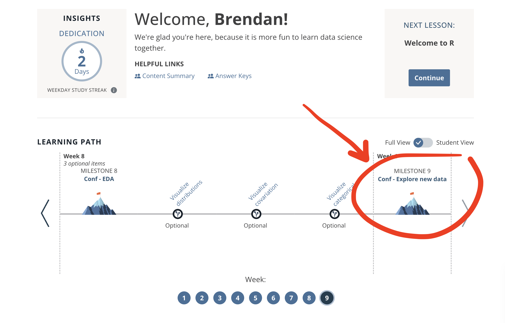
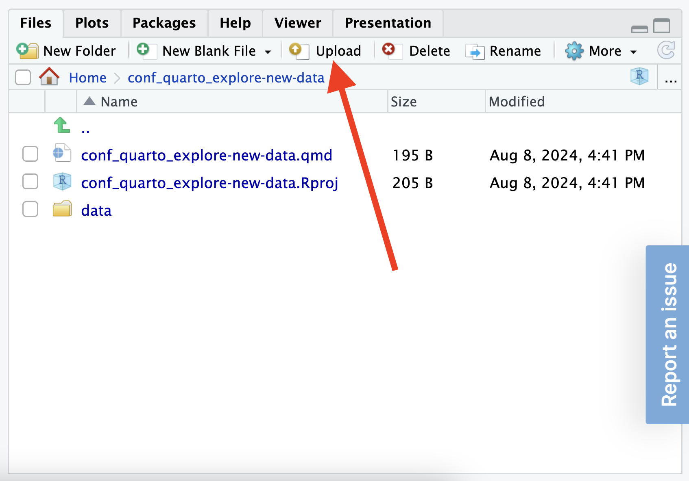
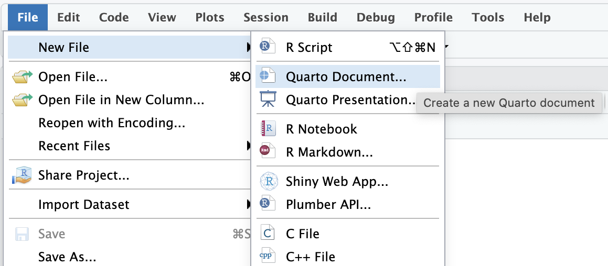

class:

```{r setup, include=FALSE}
options(htmltools.dir.version = FALSE)
knitr::opts_chunk$set(fig.retina = 3)
library(tidyverse)
```

# `r rmarkdown::metadata$title`

### `r rmarkdown::metadata$subtitle`

<div class="title-footer">
  
  <div> `r rmarkdown::metadata$date`</div>
</div>


```{r xaringan-stuff, include=FALSE}
xaringanExtra::use_xaringan_extra(c("tile_view", "panelset", "share_again"))
xaringanExtra::use_clipboard(selector = "pre > code.r, pre > code.md")
xaringanExtra::use_tachyons()

if (!is.null(rmarkdown::metadata$shortlink)) {
  shortlink <- rmarkdown::metadata$shortlink
  if (is.character(shortlink)) {
    shortlink <- list(url = shortlink)
  }
  stopifnot(!is.null(shortlink$url))
  
  if (is.null(shortlink$text) || !nzchar(shortlink$text)) {
    shortlink$text <- basename(shortlink$url)
  }
  
  xaringanExtra::use_banner(
    bottom_left = htmltools::tags$a(href = shortlink$url, shortlink$text),
    exclude = "title-slide"
  )
}
```


---
# Choose a new data set to explore

### Some options:

1. Your own data — e.g. a data set from work (one that others are allowed to see)

2. [Posit Academy Data Gallery](https://posit-academy.quarto.pub/data-gallery/datasets.html) - a curated list of data sets organized by industry/topic

3. [Seattle Open Data](https://data.seattle.gov/) (or some other [publicly available data](https://posit-academy.quarto.pub/data-gallery/resources.html) that interests you)

---
class:

# Getting started

```{r echo=FALSE, out.width="70%"}

```

---
# Getting started

.pull-left[

.center[**Upload your data**]

```{r echo=FALSE}

```

]

.pull-right[

.center[**Use the provided Quarto document (or create a new one)**]

```{r echo=FALSE}

```

]

---
# Work together!

* Form small groups of 2 - 3

* You can each choose a different data set to work with (or work with the same data set)

* Check in with your neighbors when you get stuck (we will come help too)

* You will share your progress with your group later on

---
# Objectives

* **Import your data** into R (anyone working with files formats other than .csv?)

* **Compute summary statistics** to better understand your data -- what types of variables do you have? How much variation is there within certain variables of interest?

* **Follow your curiosity** -- what relationships do you want to explore? Come up with one or two questions to investigate.

* **Create at least one plot and one table** to explore patterns of covariation in the data

* (Optional) **Create a rendered Quarto report**. Add formatting to your document and experiment with different output formats

## `r emo::ji("clock")` Until coffee break (3:00 PM)