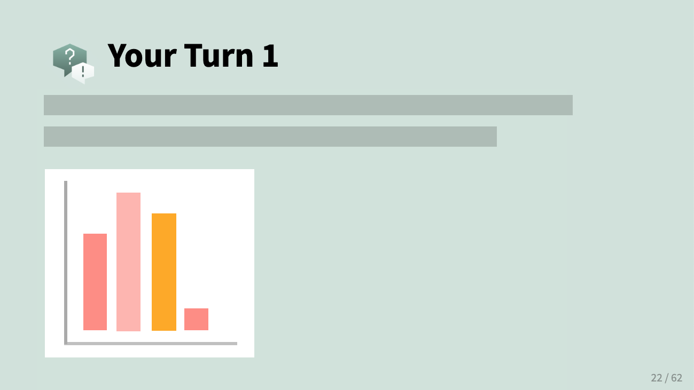

class:

```{r setup, include=FALSE}
options(htmltools.dir.version = FALSE)
knitr::opts_chunk$set(fig.retina = 3)

library(tidyverse)
```

```{r reactable-function, include=FALSE}
reactable_preview <- function(data) {
  
  page_info <- "{rowStart}-{rowEnd} of {rows} rows"
  
  if (nrow(data) > 100) {
    page_info <- glue::glue(
      "{page_info} (Total: {actual})", 
      actual = format(nrow(data), big.mark = ",")
    )
  }
  
  data %>% 
    slice_head(n = 100) %>% 
    reactable::reactable(
      defaultColDef = reactable::colDef(align = "left", maxWidth = 400),
      defaultPageSize = 8, 
      compact = TRUE,
      wrap = FALSE,
      striped = TRUE,
      sortable = FALSE, 
      showPageInfo = TRUE,
      language = reactable::reactableLang(
        pageInfo = page_info
      )
    )
}
```

```{r xaringan-stuff, include=FALSE}
xaringanExtra::use_xaringan_extra(c("tile_view", "panelset", "share_again"))
xaringanExtra::use_clipboard(selector = "pre > code.r, pre > code.md")
xaringanExtra::use_tachyons()

if (!is.null(rmarkdown::metadata$shortlink)) {
  shortlink <- rmarkdown::metadata$shortlink
  if (is.character(shortlink)) {
    shortlink <- list(url = shortlink)
  }
  stopifnot(!is.null(shortlink$url))
  
  if (is.null(shortlink$text) || !nzchar(shortlink$text)) {
    shortlink$text <- basename(shortlink$url)
  }
  
  xaringanExtra::use_banner(
    bottom_left = htmltools::tags$a(href = shortlink$url, shortlink$text),
    exclude = "title-slide"
  )
}
```

class: title-slide

# `r rmarkdown::metadata$title`

### `r rmarkdown::metadata$subtitle`

<div class="title-footer">
  
  <div> `r rmarkdown::metadata$date`</div>
</div>

???

We're going to start off with some review of what we've learned for the past several weeks.

---
class: inverse

# Go to **Conf - Warm-up**

.center[
```{r session1-workspace, echo = FALSE, out.width = "60%", fig.align = "center"}

```

[rconf.posit.academy](https://rconf.posit.academy/)
]

---

## `r emo::ji("rocket")` Warm-up

.pull-left[
```{r label, echo = FALSE}

```

]

.pull-right[

* __Work together__ with your neighbors

* There are often several different ways of getting to the right answer.

* After 1-2 minutes, we'll go over the answer together. And then move on to the next question. 

]

---
class: inverse, center, middle

.pull-left[

## Done

```{r, echo = FALSE}
knitr::include_graphics("images/welcome/green-square.png")
```
]

.pull-right[

## Help

```{r, echo = FALSE}
knitr::include_graphics("images/welcome/pink-square.png")
```
]

???

You'll use the sticky system to signal that you're done or your need help

---
class: inverse
background-position: center
background-size: cover

```{r load-data, include=FALSE}
library(tidyverse)

seattle_pets <- read_csv("data/warm-up/seattle_pets.csv")
```

# Seattle Pet Licenses data

Look for `data/seattle_pets.csv` in your Files pane

Source: https://data.seattle.gov/Community/Seattle-Pet-Licenses/jguv-t9rb/about_data

???

This data was retrieved from Seattle's Open Data Portal. It was last updated in July 2024.

It contains a list of current Seattle pet licenses, including animal type (species), pet's name, breed and the owner's ZIP code.

---
class: your-turn

# Your Turn 1

**Read in the data saved in `data/seattle_pets.csv` and explore it. Can you recreate output that looks like this?**

`r emo::ji("bulb")` Hint: What function from dplyr gives you a quick glimpse of your data?

```{r read-in-outbreaks, include = FALSE}
seattle_pets <- readr::read_csv("data/warm-up/seattle_pets.csv")
```

```{r echo = FALSE}
glimpse(seattle_pets)
```


---

## Solution 1

```{r sol-1, eval = FALSE}
library(tidyverse)

seattle_pets <- read_csv("data/seattle_pets.csv")

glimpse(seattle_pets)
```

```{r echo = FALSE, message = FALSE}
glimpse(seattle_pets)
```

---
class: your-turn

# Your Turn 2

**How many different species are represented in `seattle_pets`? How many pets of each species are there?**


`r emo::ji("bulb")` Hint: What function from dplyr lets you count the unique values of one or more variables?

---

# Solution 2

.pull-left[
```{r eval = FALSE}
seattle_pets |> 
  count(species)
```

or...

```{r eval = FALSE}
seattle_pets |> 
  group_by(species) |> 
  summarize(n = n())
```

]

.pull-right[
```{r echo = FALSE, message = FALSE}
seattle_pets |> count(species)
```

]


---
# Solution 2

Because I was curious... what does one name a pet pig? 

```{r}
seattle_pets |> 
  filter(species == "Pig") |> 
  pull(animal_name)
```

---
class: your-turn

# Your Turn 3

**What is the most popular pet name in this data set?**

`r emo::ji("bulb")` Hint: Try using `slice_max()` from dplyr in your solution. Look up the help docs with `?slice_max`.

---

# Solution 3

.pull-left[

```{r eval = FALSE}
seattle_pets |> 
  count(animal_name) |> 
  slice_max(order_by = n)
```

or...

```{r eval=FALSE}
seattle_pets |> 
  count(animal_name, sort = TRUE) |> 
  head(1)
```


or...

```{r eval=FALSE}
seattle_pets |> 
  count(animal_name) |> 
  filter(n == max(n))
```

]

.pull-right[

```{r echo = FALSE, message = FALSE}
seattle_pets |> 
  count(animal_name) |> 
  slice_max(order_by = n)
```

]

---
class: your-turn

# Your Turn 4

**What are the top 10 most popular primary dog breeds?**

`r emo::ji("bulb")` Hint: Try using `count()` and `slice_max()` again in your solution -- which argument to `slice_max()` specifies the number of rows to return?

---

# Solution 4

```{r eval=FALSE}
seattle_pets |> 
  filter(species == "Dog") |> 
  count(primary_breed) |> 
  slice_max(order_by = n, n = 10)
```

```{r echo=FALSE}
seattle_pets |> 
  filter(species == "Dog") |> 
  count(primary_breed) |> 
  slice_max(order_by = n, n = 10)
```

---
class: your-turn

# Your Turn 5 -- last one!

**Visualize the top 10 dog breeds, re-creating the plot below.**

.pull-left[

`r emo::ji("bulb")` Hint: Start with your code from the previous exercise:

```{r eval=FALSE}
seattle_pets |> 
  filter(species == "Dog") |> 
  count(primary_breed) |> 
  slice_max(order_by = n, n = 10) |> 
  ____ # add code here
```

]

.pull-right[
```{r echo=FALSE, out.width="80%"}
seattle_pets |> 
  filter(species == "Dog") |> 
  count(primary_breed) |> 
  slice_max(order_by = n, n = 10) |> 
  ggplot(aes(primary_breed, n)) + 
  geom_col() + 
  coord_flip()
```

]

---

# Solution 5

.pull-left[

```{r eval=FALSE}
seattle_pets |> 
  filter(species == "Dog") |> 
  count(primary_breed) |> 
  slice_max(order_by = n, n = 10) |> 
  ggplot(aes(x = primary_breed, y = n)) + 
  geom_col() + 
  coord_flip()
```

or ...

```{r eval=FALSE}
seattle_pets |> 
  filter(species == "Dog") |> 
  count(primary_breed) |> 
  slice_max(order_by = n, n = 10) |> 
  ggplot(aes(x = n, y = primary_breed)) + 
  geom_col()
```

]

.pull-right[
```{r echo=FALSE, out.width="80%"}
seattle_pets |> 
  filter(species == "Dog") |> 
  count(primary_breed) |> 
  slice_max(order_by = n, n = 10) |> 
  ggplot(aes(x = primary_breed, y = n)) + 
  geom_col() + 
  coord_flip()
```

]

---
class: inverse, middle, center

# Nice work!


---
# `r emo::ji("thinking_face")` Exploring `seattle_pets` further...

.pull-left[
What if we wanted visualize popular dog breeds in descending order?

We would need to handle **factors** (categorical variables).
]

.pull-right[
```{r echo=FALSE, out.width = "90%"}
seattle_pets |> 
  filter(species == "Dog") |> 
  count(primary_breed) |> 
  slice_max(n, n = 10) |> 
  ggplot(aes(fct_reorder(primary_breed, n), n)) + 
  geom_col() + 
  coord_flip() + 
  labs(x = "primary_breed")
```

]

---
# `r emo::ji("thinking_face")` Exploring `seattle_pets` further...

.pull-left[
What if we wanted visualize trends in number of new pet licences by month?

We would need to handle **dates**.
]

.pull-right[

```{r echo=FALSE, message = FALSE, warning = FALSE, out.width = "90%"}
seattle_pets |> 
  mutate(
    license_issue_date = mdy(license_issue_date),
    month = month(license_issue_date, label = TRUE),
    year = year(license_issue_date)
  ) |> 
  group_by(month, year) |> 
  summarize(n = n()) |> 
  group_by(month) |> 
  summarize(mean_licenses = mean(n))  |> 
  ggplot(aes(month, mean_licenses, group = 1)) + 
  geom_point() + 
  geom_line()
```

]

---
# `r emo::ji("thinking_face")` Exploring `seattle_pets` further...

.pull-left[
What if we wanted to explore pet names with a particular pattern?   

e.g. Pets with "Sir" somewhere in their name.

We would need to handle **strings**.
]

.pull-right[

```{r echo=FALSE}
seattle_pets |> 
  filter(str_detect(animal_name, "Sir ")) |> 
  select(animal_name, species) |> 
  print(n = "Inf")
```

]

---
# Data types 

Fortunately, the tidyverse provides us with tools to work with these different types of data...

<br>

.center[

```{r echo=FALSE, out.width="25%"}
knitr::include_graphics("https://github.com/rstudio/hex-stickers/blob/main/PNG/stringr.png?raw=true")

knitr::include_graphics("https://github.com/rstudio/hex-stickers/blob/main/PNG/forcats.png?raw=true")

knitr::include_graphics("https://github.com/rstudio/hex-stickers/blob/main/PNG/lubridate.png?raw=true")
```

]