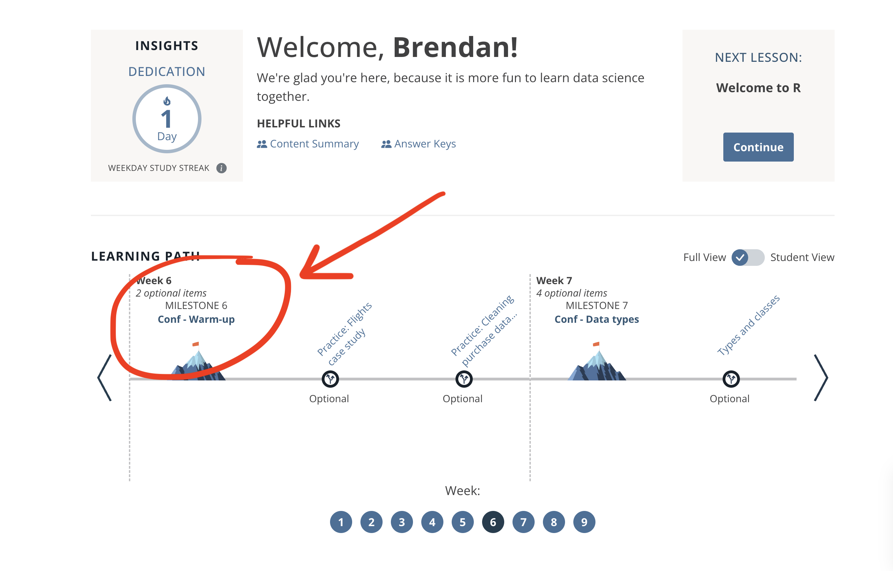

class:

```{r setup, include=FALSE}
options(htmltools.dir.version = FALSE)
knitr::opts_chunk$set(fig.retina = 3)

library(tidyverse)
```

```{r reactable-function, include=FALSE}
reactable_preview <- function(data) {
  
  page_info <- "{rowStart}-{rowEnd} of {rows} rows"
  
  if (nrow(data) > 100) {
    page_info <- glue::glue(
      "{page_info} (Total: {actual})", 
      actual = format(nrow(data), big.mark = ",")
    )
  }
  
  data %>% 
    slice_head(n = 100) %>% 
    reactable::reactable(
      defaultColDef = reactable::colDef(align = "left", maxWidth = 400),
      defaultPageSize = 8, 
      compact = TRUE,
      wrap = FALSE,
      striped = TRUE,
      sortable = FALSE, 
      showPageInfo = TRUE,
      language = reactable::reactableLang(
        pageInfo = page_info
      )
    )
}
```

```{r xaringan-stuff, include=FALSE}
xaringanExtra::use_xaringan_extra(c("tile_view", "panelset", "share_again"))
xaringanExtra::use_clipboard(selector = "pre > code.r, pre > code.md")
xaringanExtra::use_tachyons()

if (!is.null(rmarkdown::metadata$shortlink)) {
  shortlink <- rmarkdown::metadata$shortlink
  if (is.character(shortlink)) {
    shortlink <- list(url = shortlink)
  }
  stopifnot(!is.null(shortlink$url))
  
  if (is.null(shortlink$text) || !nzchar(shortlink$text)) {
    shortlink$text <- basename(shortlink$url)
  }
  
  xaringanExtra::use_banner(
    bottom_left = htmltools::tags$a(href = shortlink$url, shortlink$text),
    exclude = "title-slide"
  )
}
```

class: title-slide

# `r rmarkdown::metadata$title`

### `r rmarkdown::metadata$subtitle`

<div class="title-footer">
  
  <div> `r rmarkdown::metadata$date`</div>
</div>

???

We're going to start off with some review of what we've learned for the past several weeks.

---
class: inverse

# Go to **Conf - Warm-up**

.center[
```{r session1-workspace, echo = FALSE, out.width = "60%", fig.align = "center"}

```

[rconf.posit.academy](https://rconf.posit.academy/)
]

---

## `r emo::ji("rocket")` Warm-up


```{r label, echo = FALSE, out.width="60%"}
knitr::include_graphics("images/welcome/your-turn-example.png")
```

* __Working together__ with your neighbors is encouraged.

* After 1-2 minutes, we'll go over the answer together. And then move on to the next question. 

---
class: inverse, center, middle

.pull-left[

## Done

```{r, echo = FALSE}
knitr::include_graphics("images/welcome/green-square.png")
```
]

.pull-right[

## Help

```{r, echo = FALSE}
knitr::include_graphics("images/welcome/pink-square.png")
```
]

???

You'll use the sticky system to signal that you're done or your need help

---
class: center, middle, inverse
background-position: center
background-size: cover

```{r load-data, include=FALSE}
library(tidyverse)

seattle_pets <- read_csv("data/warm-up/seattle_pets.csv")
```

# Seattle pets

# `r emo::ji("dog")` `r emo::ji("cat")`

---
class: your-turn

# Your Turn 1

Read in the `seattle_pets` data and explore it. Can you recreate output that looks like this?

```{r read-in-outbreaks, include = FALSE}
seattle_pets <- readr::read_csv("data/warm-up/seattle_pets.csv")
```

.space-saver[
```{r echo = FALSE}
glimpse(seattle_pets)
```
]

???

1 minute

---

## Solution 1
.pull-left[
```{r sol-1, eval = FALSE}
library(tidyverse)

seattle_pets <- 
  read_csv("data/seattle_pets.csv")

glimpse(seattle_pets)
```
]

.pull-right.space-saver[
```{r echo = FALSE, message = FALSE}
glimpse(seattle_pets)
```
]

