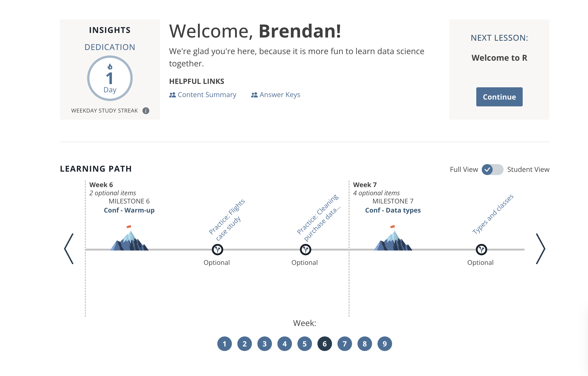
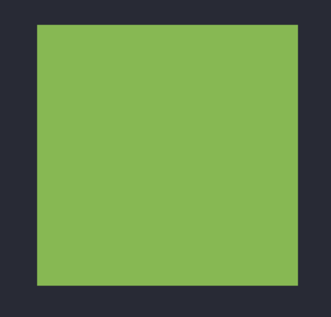
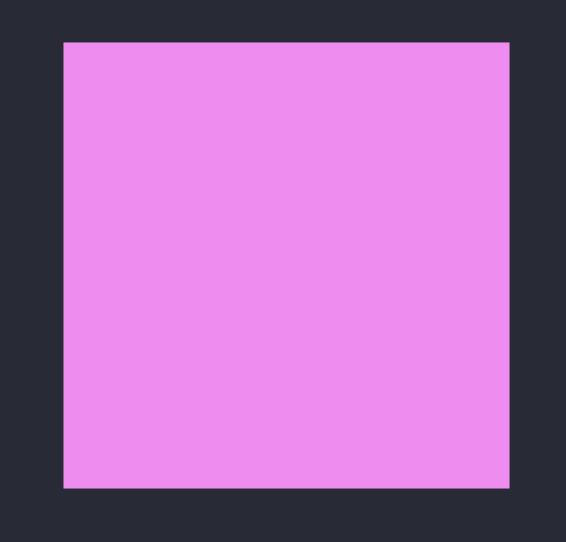
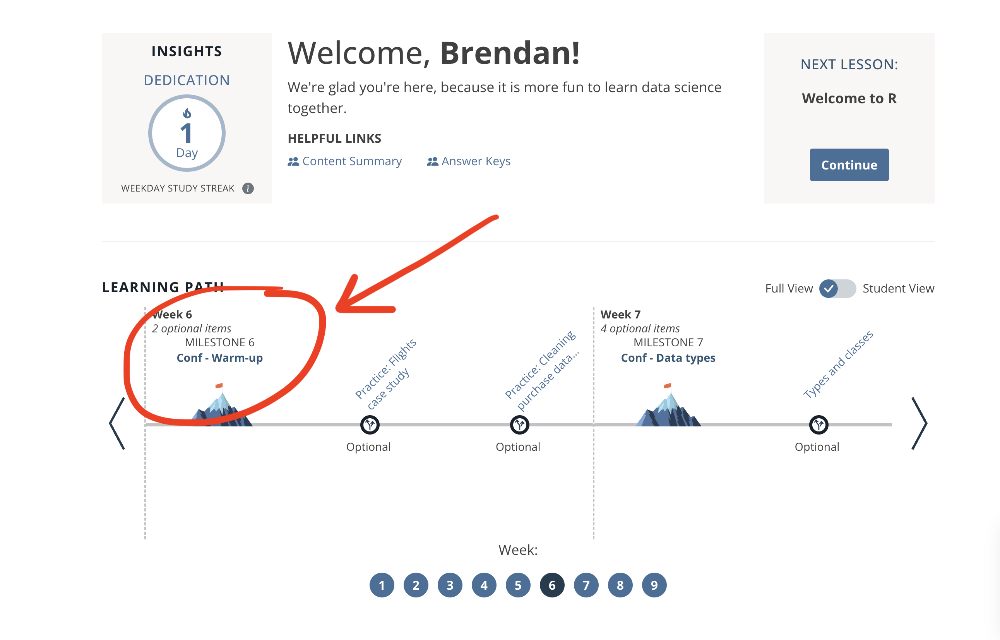

class:

```{r setup, include=FALSE}
options(htmltools.dir.version = FALSE)
knitr::opts_chunk$set(fig.retina = 3)
library(tidyverse)
```

```{r reactable-function, include=FALSE}
reactable_preview <- function(data) {
  
  page_info <- "{rowStart}-{rowEnd} of {rows} rows"
  
  if (nrow(data) > 100) {
    page_info <- glue::glue(
      "{page_info} (Total: {actual})", 
      actual = format(nrow(data), big.mark = ",")
    )
  }
  
  data %>% 
    slice_head(n = 100) %>% 
    reactable::reactable(
      defaultColDef = reactable::colDef(align = "left", maxWidth = 400),
      defaultPageSize = 8, 
      compact = TRUE,
      wrap = FALSE,
      striped = TRUE,
      sortable = FALSE, 
      showPageInfo = TRUE,
      language = reactable::reactableLang(
        pageInfo = page_info
      )
    )
}
```

```{r xaringan-stuff, include=FALSE}
xaringanExtra::use_xaringan_extra(c("tile_view", "panelset", "share_again"))
xaringanExtra::use_clipboard(selector = "pre > code.r, pre > code.md")
xaringanExtra::use_tachyons()

if (!is.null(rmarkdown::metadata$shortlink)) {
  shortlink <- rmarkdown::metadata$shortlink
  if (is.character(shortlink)) {
    shortlink <- list(url = shortlink)
  }
  stopifnot(!is.null(shortlink$url))
  
  if (is.null(shortlink$text) || !nzchar(shortlink$text)) {
    shortlink$text <- basename(shortlink$url)
  }
  
  xaringanExtra::use_banner(
    bottom_left = htmltools::tags$a(href = shortlink$url, shortlink$text),
    exclude = "title-slide"
  )
}
```


# .big-text[Welcome] 

# Introduction to Data Science with R

WiFi: **Posit Conf 2024**

Password: **conf2024**

<div class="title-footer">
  
  <div> `r rmarkdown::metadata$date`</div>
</div>

---
class: middle, agenda

# Agenda

1. Intro
1. Workshop logistics
1. Warm-up
1. Data types

???

---
class: inverse, center, middle
background-image: url("https://images.unsplash.com/photo-1538370965046-79c0d6907d47?ixlib=rb-1.2.1&ixid=MnwxMjA3fDB8MHxwaG90by1wYWdlfHx8fGVufDB8fHx8&auto=format&fit=crop&w=2938&q=80")
background-size: cover

# .big-text.white[Welcome!]

???

Welcome to this in-person component of Introduction to Data Science with R with Posit Academy. You are all here because you're invested in learning R and making sure it sticks. You've already taken a huge step forward toward that goal over the last 5 weeks with Posit Academy. 

Our goal today is guide you through some ways of prac and take advantage of being together in person to dive deeper into topics that interest you.

---
class: inverse

# Objectives

--

1. Practice with some familiar wrangling skills with the tidyverse and explore new ones

--

2. Learn best practices for exploring your data

--

3. Apply your skills to investigating new data

---
class: speaker-slide

# Hello (again)!
<!-- You can copy the image link address from your github profile to use as the src link below --> 

.pull-left[


Brendan Cullen

.speaker-links[
`r fontawesome::fa("envelope")` brendan.cullen@posit.co
]
]

.pull-right[


Kristin Bott
.speaker-links[
`r fontawesome::fa("envelope")` kristin.bott@posit.co
]
]


---
class: center, top

# Schedule

.spaced[

| Time          | Activity                                  |
| :------------ | :---------------------------------------- |
| 09:00 - 10:30 | Session 1 - Welcome, Warm-up & Data types |
| 10:30 - 11:00 | *Coffee break*                            |
| 11:00 - 12:30 | Session 2 - Exploratory data analysis     |
| 12:30 - 13:30 | *Lunch break*                             |
| 13:30 - 15:00 | Session 3 - Explore new data              |
| 15:00 - 15:30 | *Coffee break*                            |
| 15:30 - 17:00 | Session 4 - Share and Wrap-up             |

]

---
class: middle, chapter-slide blue

.big-white-number[1.]

# Workshop logistics

---
class: middle, center, inverse

.pull-left[
# `r fontawesome::fa("fas fa-wifi")`
Wifi network  

.light-red[`r params$wifi_network`]

]

.pull-right[
# `r fontawesome::fa("fas fa-key")`

Wifi password

.light-red[`r params$wifi_password`]

]

---
class: inverse
# Important information

## `r emo::ji("pin")` [intro-tidyverse-2024.netlify.app](https://intro-tidyverse-2024.netlify.app/)

* Locations (bathrooms, lactation room, meditation room)

* Photography policy

* Code of conduct (https://posit.co/code-of-conduct/)

---
class: inverse, center

# rconf.posit.academy

```{r echo=FALSE, out.width="60%"}

```

???

Demo conf campsite

---
class: inverse, center

# Slack 

## \#academy-conf24-r-workshop

For sharing code, announcements and resources. 

This channel will remain up until 8/30.

---
class: inverse, center
# Stickies

.pull-left[

## Done

```{r g, echo = FALSE, out.width = "40%"}

```
]

.pull-right[

## Help

```{r p, echo = FALSE, out.width = "40%"}

```
]

???
Finally --  throughout the workshop, we'll use sticky notes to signal either being done with an activity or needing help. 

* You should place a green sticky on your laptop if you’re done with an exercise and a pink sticky if you want help. [CLICK]

* You can use pink stickies at anytime during the session to signal that you're stuck, lost, or would like help.

* We will be on the lookout for stickies throughout each session. 

---
class: inverse, middle, center

.big-text.white[
# Questions?
]

---
class: middle, chapter-slide green

.big-white-number[3.]

# Warm-up

---
class: inverse, middle, center

# Start here

```{r echo=FALSE, out.width="60%"}

```
