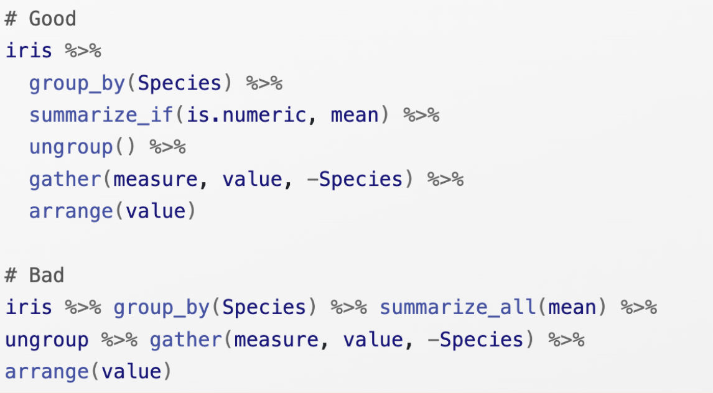

class:

```{r setup, include=FALSE}
options(htmltools.dir.version = FALSE)
knitr::opts_chunk$set(fig.retina = 3)
library(tidyverse)
```

# `r rmarkdown::metadata$title`

### `r rmarkdown::metadata$subtitle`

<div class="title-footer">
  
  <div> `r rmarkdown::metadata$date`</div>
</div>


```{r xaringan-stuff, include=FALSE}
xaringanExtra::use_xaringan_extra(c("tile_view", "panelset", "share_again"))
xaringanExtra::use_clipboard(selector = "pre > code.r, pre > code.md")
xaringanExtra::use_tachyons()

if (!is.null(rmarkdown::metadata$shortlink)) {
  shortlink <- rmarkdown::metadata$shortlink
  if (is.character(shortlink)) {
    shortlink <- list(url = shortlink)
  }
  stopifnot(!is.null(shortlink$url))
  
  if (is.null(shortlink$text) || !nzchar(shortlink$text)) {
    shortlink$text <- basename(shortlink$url)
  }
  
  xaringanExtra::use_banner(
    bottom_left = htmltools::tags$a(href = shortlink$url, shortlink$text),
    exclude = "title-slide"
  )
}
```


---
# Agenda

1. Finish your data exploration (30 min)

2. Share your progress with your group (30 min)

3. Wrap-up (recap and resources) (30 min)

---
# Finish your data exploration

* **Import your data** into R (anyone working with files formats other than .csv?)

* **Compute summary statistics** to better understand your data -- what types of variables do you have? How much variation is there within certain variables of interest?

* **Follow your curiosity** -- what relationships do you want to explore? Come up with one or two questions to investigate.

* **Create at least one plot and one table** to explore patterns of covariation in the data

* (Optional) **Create a rendered Quarto report**. Add formatting to your document and experiment with different output formats

## `r emo::ji("clock")` Until 4:00 PM

---
# Share your work

* What did you learn? Where did you struggle? 

* Pick one plot or table and walk through how you created it

## `r emo::ji("clock")` Until 4:30 PM

---
# Wrap-up

1. Resources + Best practices 

2. Continuing education

3. Conference schedule

4. Feedback survey

---
class: middle chapter-slide red

.big-white-number[1.]

# Resources + Best practices

---
# Project-oriented workflows

.pull-left[
Use R projects to make your code more organized and shareable

***

Resources:

* [What They Forgot to Teach You About R Chapter 3: Project-oriented workflow](https://rstats.wtf/projects)

* [R4DS Chapter 6: Script and Projects](https://r4ds.hadley.nz/workflow-scripts)

* The [here package](https://here.r-lib.org/) (to manage file paths)
]

.pull-right[

```{r echo=FALSE}

```

]

---
# Code style

.pull-left[
Consistent style makes your easier to read & debug by your future self and collaborators

***

Resources:

* [Tidyverse style guide](https://style.tidyverse.org/)

* The [styler package](https://styler.r-lib.org/)

* [R4DS Chapter 4: Code Style](https://r4ds.hadley.nz/workflow-style) (short primer)
]

.pull-right[

```{r echo=FALSE}
#| fig.cap: 'Image from the Tidyverse Style Guide'

```
]

---
# Quarto

```{r echo=FALSE, out.width = "100%"}
knitr::include_url("https://quarto.org/docs/gallery/")
```

[quarto.org/docs/gallery](https://quarto.org/docs/gallery/)

---
# Quarto (at conf)

```{r echo=FALSE}


```

---
# Positron

```{r echo=FALSE}

```

[github.com/posit-dev/positron](https://github.com/posit-dev/positron)

---
# Positron (at conf)

```{r echo=FALSE, out.width = "70%"}

```

---
class: middle chapter-slide blue

.big-white-number[2.]

# Continuing education

---
# [rconf.posit.academy](https://rconf.posit.academy/)

* You will have continued access to the Academy website for 45 days (Slack channels will stay up until August 30th). Check out optional tutorials and case studies for more practice.

* You can download milestone materials for later reference. In your Files pane:
  1. Click **Home** and select the folder(s) you want to export
  1. Click **More**
  1. Click **Export...** (and save a .zip file to your computer)

```{r echo=FALSE}

```


---
# Books and websites

* [R for Data Science](https://r4ds.hadley.nz/) (second edition)

* [ggplot2: Elegant Graphics for Data Analysis](https://ggplot2-book.org/index.html) (third edition)

* …and many many more! (See [Big Book of R](https://www.bigbookofr.com/))

* [Posit Community](https://community.rstudio.com/) – an online forum where you can search, read, or post questions about R

* The [tidyverse blog](https://www.tidyverse.org/blog/) – for all the latest updates and features

* [TidyTuesday](https://github.com/rfordatascience/tidytuesday#readme) – weekly opportunity to practice using new datasets to create data visualizations using R

---

<div class="title-footer">
  
  <div> More info at <a https://posit.co/products/enterprise/academy/" rel="noopener noreferrer" target="_blank">posit.co/academy</a></div>
</div>

# Posit Academy

**Foundations of the Tidyverse** (10 weeks) -
Import, visualize and wrangle data with the tidyverse and report reproducibly with Quarto

**Foundations of Python for Data Science** (10 weeks) -
Import, visualize data with plotnine, wrangle data with pandas and report reproducibly with Quarto

**Programming in R** (6 weeks) -
Write functions in R, iterate and debug code

**Shiny for R** (4 weeks) -
Build Shiny apps to automate work and make data more user-friendly


### `r emo::ji("wave")` Email us academy@posit.co - or ask any Posit employee in the Lounge!

---
class: middle chapter-slide green

.big-white-number[3.]

# Conference schedule

---
# Search for sessions by topic

.pull-left[

Browse the [session catalog](https://reg.conf.posit.co/flow/posit/positconf24/publiccatalog/page/publiccatalog)

```{r echo=FALSE}

```

]

.pull-right[

Download the mobile app

```{r echo=FALSE, out.width = "70%"}

```

]

---
# Social/Networking events

```{r echo=FALSE}

```

---
class: middle chapter-slide tan

.big-white-number[4.]

# Feedback

---
class: your-turn

# Your turn

## Please go to [pos.it/conf-workshop-survey](http://pos.it/conf-workshop-survey)

Your feedback is crucial and informs curriculum 
and format decisions for future workshops. 

We really appreciate you taking the time to provide it :-) 

---
class: center, middle

# [pos.it/conf-workshop-survey](http://pos.it/conf-workshop-survey)

### Thank you so much for being a part of this course + workshop!

```{r echo=FALSE}
knitr::include_graphics("images/wrap-up/fuzzy-monster.png")
```

